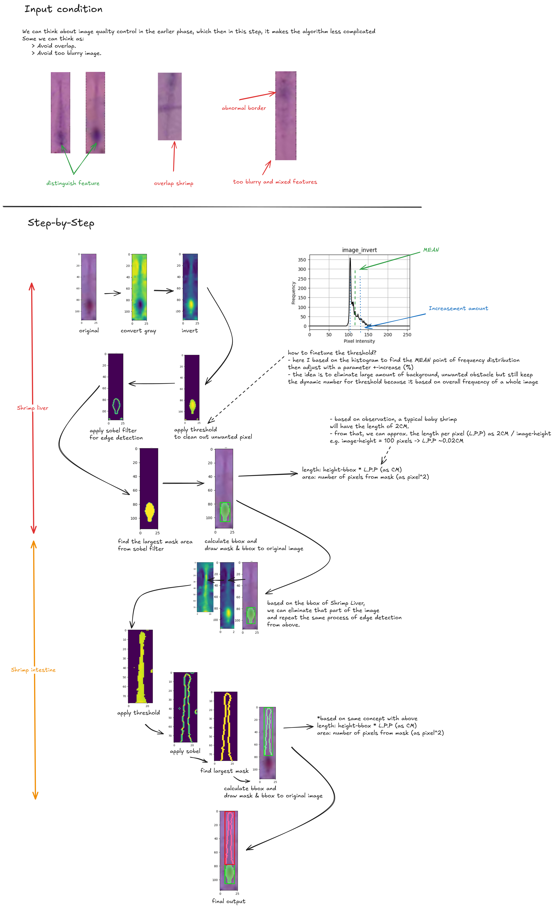

# TinsTest
Description: 
We have prepared a set of images of the actual shrimps can you help us write a blob detection algorithm using Python to check for: 
- Shrimp liver 
- Shrimp intestine track 
Note: Feel free to use any image processing techniques that you can think of to simplize your task 

Deliverables: 
- Python code to detect shrimp liver - its length and area
- Python code to detect shrimp intestine track - its length and area
- Graph or Graphs showing the distribution of the both features
- Presentation and explanation of your codes

Deadline: 
March 15th, 2025

# Tin Comment
- Thank you waiting for me till this time.
- I have jumpped around with my main tasks and I just finished with my thought about the assignment (~1.5 days).
- You can find the result at <code>./Images/Results</code>, included the masked image and <code>*.csv</code> file for length and area information.
- You can use <b>Jupyter Lab/Notebook</b> and run <code>main.ipynb</code> file to get to know with the code (Sorry for dirty and messy code).
- I used the <code>example.png</code> file to replace my presentation.

# Observation
- There are lots of false sample, mostly because of unclear and mixed features.
- For some image with clearer features, the idea seem works well to define the liver.
- I intended to use AI model but then the data is too little to handle the model so I brainstormed with traditional CV techniques.

